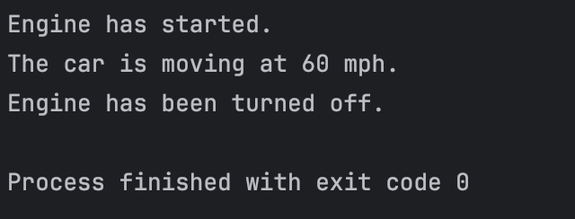
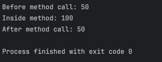
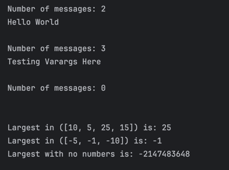
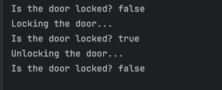
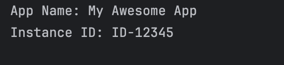
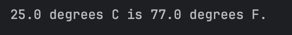
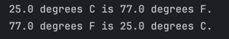
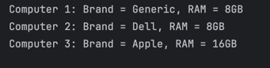
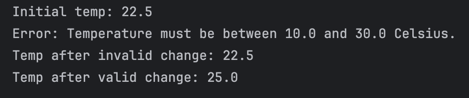
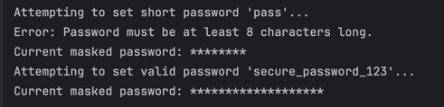

**Dolendo, Jericho Paolo T.** 
**Mastering Methods and Encapsulation** 
 
**Designing Methods**

 
**Passing Parameters** 

 
**Using Varargs** 

 
**Access Specifiers** 

 
**Static Methods and Variables** 

 
**Method Overloading** 

 
**Constructors and Constructor Overloading** 

 
**Encapsulation** 

